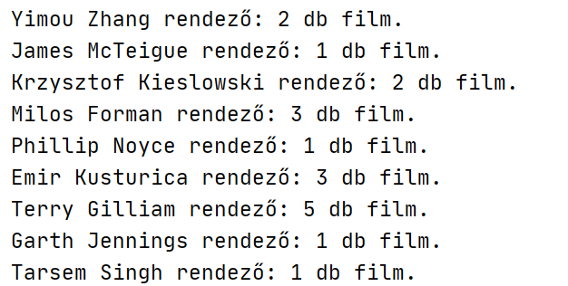

# Python ágazati vizsga teszt - Filmek

1.) Olvasd be a mellékelt file (film.txt) tartalmát, majd add meg az adatok sorainak a számát (az első sor nélkül)!  
2.) Melyik a legrövidebb film címe?  
3.) Hány darab legalább 110 perces film van?  
4.) Kérd be egy színész nevét, és ajánlj egy pár filmet a készletből, ha tudsz (film címét íratjuk ki, ha van ilyen)! Ha nincs ilyen nevű színész, akkor azt is tudasd!  
5.) A 4-es feladat eredményét írasd ki fájlba is! (szorgalmi)  
6.) Készíts statisztikát a rendezők alapján! (Hány filmjük szerepel a listában?)  
(A feladat nehézségét az adja, hogy előfordul, hogy néhol 2 rendező is fel van tüntetve “, “-vel elválasztva egymástól)  

Részlet a megoldásból:



Az utolsó feladathoz segítség lehet: gyűjtheted dictionary-be a (rendező: db), kulcs-érték párokat. Ha már szerepel a rendező (kulcs) a szótárban, a db-ot növeled, ha nem, akkor bővíted a szótárt. hozzáadás a szótárhoz pl.: film[“rendező neve”] = 1

Szótárra ciklus pl. (kulcs és érték kiíratása):

```python
for x, y in szotar.items():

   print(x, y)
```
